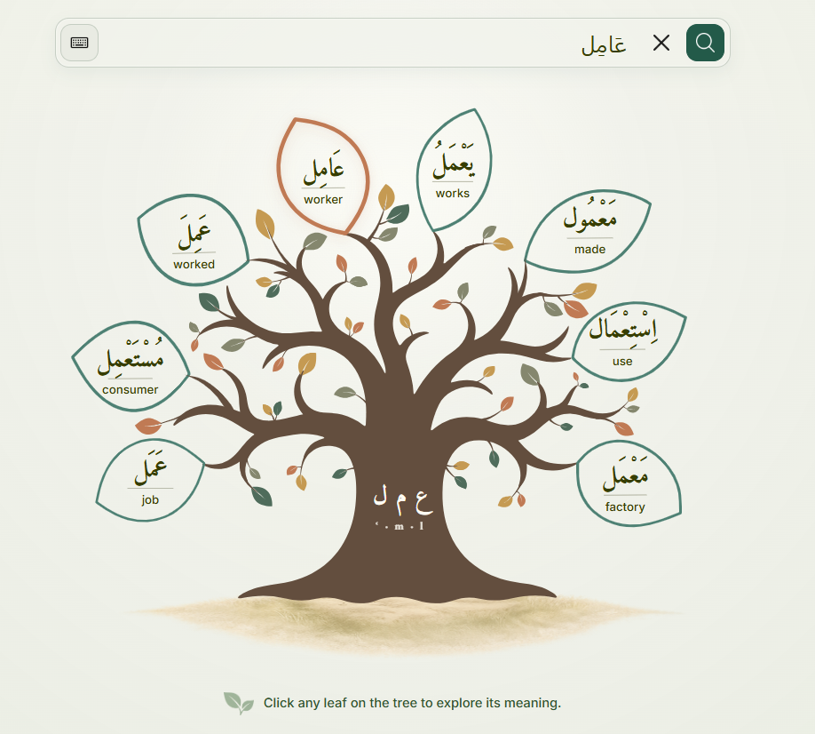
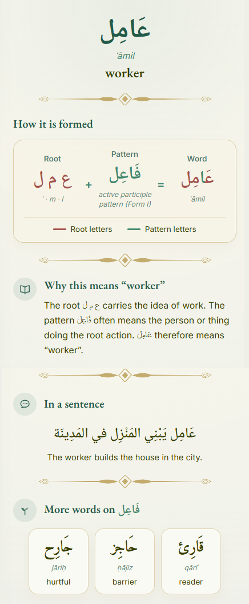
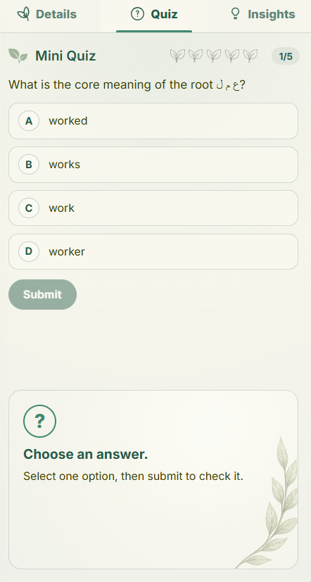
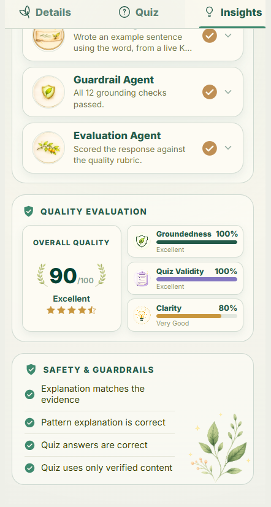

<div align="center">


### Learn Arabic from the root up.

Every Arabic word grows from a three-letter **root** (جذر) poured into a **pattern** (وزن).
Wazn shows a learner that structure instead of asking them to memorise past it.

[**Try it live →**](https://wazn-peach.vercel.app)

<sub>React · Vite · FastAPI · K2 Think</sub>

<!-- GitHub only plays a video from an absolute raw URL; a relative path renders
     as a dead link. `raw/HEAD/` follows the default branch, so this keeps working
     without pinning a branch name that will change. -->
<video src="https://github.com/Cha-Imaa/wazn-end-to-end/raw/HEAD/.github/media/wazn-demo.mp4" controls muted loop playsinline width="900"></video>

<sub><a href="https://github.com/Cha-Imaa/wazn-end-to-end/raw/HEAD/.github/media/wazn-demo.mp4">▶ Watch the demo</a></sub>

</div>

---

## The idea

Search **عَامِل** *(ʿāmil, "worker")* and Wazn takes it apart:

- **Root** — ع م ل, the idea of **work**
- **Pattern** — فَاعِل, the **active participle**: *the one doing the root action*
- **So** — one who works → **worker**

That same root in other patterns gives مَعْمَل *(factory)*, مُسْتَعْمِل *(consumer)*, اِسْتِعْمَال *(use)*, عَمَل *(job)*. Wazn draws them as one tree, because that is what they are: one family, one root.



Learn the root and the pattern, and you haven't learned one word — you've learned the shape of dozens.

## Why it's built this way

**The morphology is verifiable, not generated.** The tree, the letter-by-letter breakdown, and the word family all come from a hand-curated knowledge base. `GET /api/analyze` runs no language model — every response carries `"source": "deterministic"` and a trace of how it got there. A learner is never shown a hallucinated root.

The model earns its place elsewhere. On a **separate** `/api/insights` endpoint, K2 Think writes the explanation, the practice questions, and an example sentence — then a guardrail agent checks that output back against the knowledge base before it's shown. Every K2 step falls back to a template if it fails.

Splitting the endpoints is the point: the trustworthy path stays fast, and the generative path can take its time.

## A look inside

Click any leaf and the companion panel follows it. Three tabs.

<table>
<tr>
<td width="34%" align="center"></td>
<td width="66%" valign="top">

**Details.** Root + pattern = word, spelled out, with root and pattern letters colour-coded — red for the root that carries the meaning, teal for the pattern that shapes it.

Below that: why the word means what it means, an example sentence written for it, and the other words built on the same pattern. Recognise the pattern once and you can read all of them.

</td>
</tr>
</table>

<table>
<tr>
<td width="50%"></td>
<td width="50%"></td>
</tr>
<tr>
<td><b>Quiz.</b> Recall the family from the root alone, with the tree's labels hidden.</td>
<td><b>Insights.</b> Which module found the word, which agent wrote the explanation, whether the grounding checks passed.</td>
</tr>
</table>

## Run it locally

Backend first — the frontend calls it on every search. Needs Python ≥ 3.10.

```bash
cd backend && pip install -r requirements.txt
uvicorn app.main:app --reload --port 8000
```

```bash
cd frontend && npm install
npm run dev
```

Open <http://localhost:5173> and search `عامل`.

| Variable | Where | Notes |
|---|---|---|
| `VITE_WAZN_API_BASE_URL` | `frontend/.env` | Defaults to `http://127.0.0.1:8000` |
| `K2_API_KEY` | `backend/.env` | Needed for Insights; without it the agents fall back to templates |
| `ENABLE_K2_*` | `backend/.env` | Per-agent switches: `EXPLANATION`, `QUIZ`, `SENTENCE`, `GUARDRAIL_REVIEW`, `EVALUATION` |

CORS errors in the browser mean your frontend origin is missing from the allowlist in `backend/app/main.py`.

## How it fits together

```
search ──▶ GET /api/analyze ──▶ deterministic, no LLM
             lookup · morphology · tree · quiz · guardrail

Insights ─▶ GET /api/insights ─▶ K2 Think, with fallbacks
             explanation · quiz · sentence · guardrail · evaluation
```

`backend/` is FastAPI: content is plain JSON in `data/`, loaded once at startup — no database. `frontend/` is React + Vite: two views, no router, and a numbered CSS cascade where the order is load-bearing.
